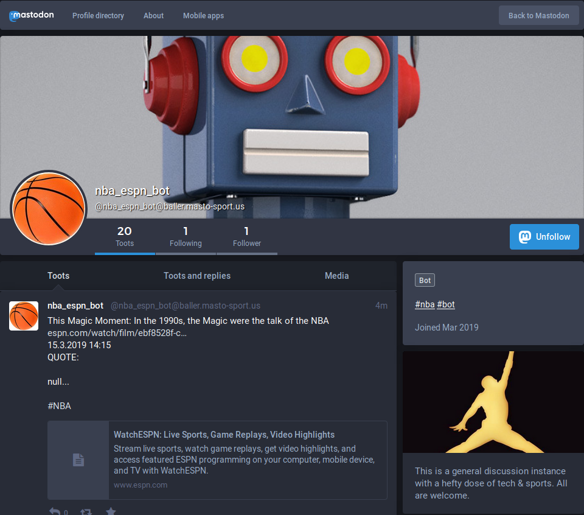

# rss2mastodon

Post an RSS or Atom feed to a [Mastodon](https://github.com/tootsuite/mastodon) account.

## Overview

1.  Uses [PHP-CLI](http://php.net/manual/en/features.commandline.usage.php) and [Composer](https://getcomposer.org).
2.  No database or web server required.
3.  Fast, secure, and easy to maintain.

## Example:

## Notes:

1.  Please reference the comments in _index.php_ for more information.
2.  Feel free to submit issues and pull requests.

🙇

https://joinmastodon.org/
